## Hi there 😊

  
  

    I'm <a href="https://willingconsulting.com">Carol Willing</a> (she/her), and I'm a Python Core Developer, a three-time Python Steering Council member, PSF Fellow, and a Project Jupyter core contributor.
  

  <blockquote>
  I was interested in doing it, there was an opportunity, so I just did it.
  
  <a href="http://www.pmg.csail.mit.edu/~liskov/">&mdash; Barbara Liskov</a>
  </blockquote>

I'm also a leader in open science and open-source governance. I'm driven to make open science accessible through open tools and learning materials.

- 2017 ACM Software System Award for Project Jupyter's lasting influence
- 2019 Frank Willison Award for technical and community contributions to Python

I enjoy speaking about Python, Jupyter notebooks, scaling reproducible research, learning, open source governance, cognitive science, and the intersection of technology and society.
Check out my [speakerdeck](https://speakerdeck.com/willingc) and [youtube](https://www.youtube.com/@CarolWilling/featured) channel.

I'm grateful for [PyLadies](https://pyladies.com) and the impact it has had on my life.

🌊 When I'm not coding, mentoring, or teaching, I enjoy exploring the tide pools and finding
:octopus: :shell: creatures 🦦.

### 🍎 Learn 🏗️ Build 🎁 Share

 

 
 

 
 

 
